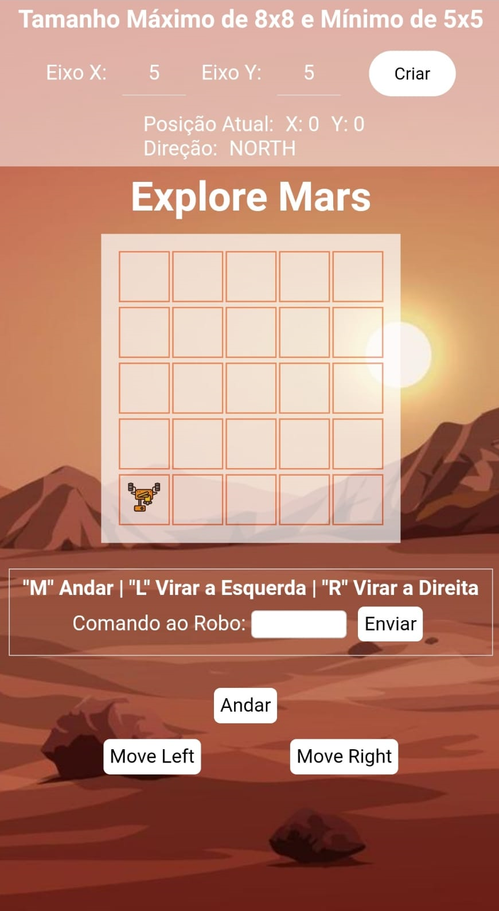
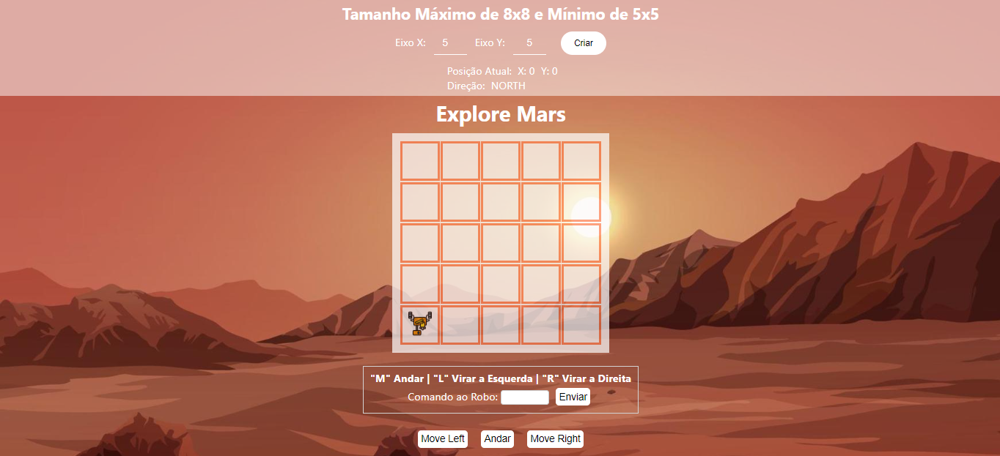

<h4 align="center"> 
	🚧  MRSA Concluído 🚀 🚧
</h4>

<p align="center">
 <a href="#-sobre-o-projeto">Sobre</a> •
 <a href="#-funcionalidades">Funcionalidades</a> •
 <a href="#-layout">Layout</a> • 
 <a href="#-como-executar-o-projeto">Como executar</a> • 
 <a href="#-tecnologias">Tecnologias</a> • 
 <a href="#-autor">Autor</a> • 
</p>

## 💻 Sobre o projeto

MRSA - É um robô deve ser colocado pela MRSA (Mercado Radar Space Agency) para explorar um terreno em Marte.

## Projeto desenvolvido **Como um Desafio Lógico** oferecida pelo [Mercado Radar](https://www.mercadoradar.com.br/).

## ⚙️ Funcionalidades

- [x] O usuário pode criar um mapa em Marte e explorar o terreno através de um robo:

  - [x] Criar um mapa através de informações dadas pelo usuário.
  - [x] Mover o robô através de comandos dados pelo usuário.

- [x] Os usuários tem acesso ao aplicativo móvel, onde podem executar as mesmas funções.

---

## 🎨 Layout

### Mobile

<p align="center">
  
</p>

### Web

<p align="center" style="display: flex; align-items: flex-start; justify-content: center;">
  
</p>

---

## 🚀 Como executar o projeto

Este projeto é divido em três partes:

1. Frontend - Abrir a página do projeto no navegador.
2. Frontend (pasta web)
3. Mobile - Abrir a página do projeto no dispositivo móvel.

#### 🧭 Rodando a aplicação web (Frontend)

```bash

# Clone este repositório
$ git clone https://github.com/ThiagoCastagnazzi/MRSA.git

# Acesse a pasta do projeto no seu terminal/cmd
$ cd MRSA


# A aplicação será aberta após a execução do arquivo index.html

```

---

## 🛠 Tecnologias

As seguintes ferramentas foram usadas na construção do projeto:

#### **Website** ([HTML5] + [CSS3] + [JavaScript])

#### [](https://github.com/tgmarinho/Ecoleta#utilit%C3%A1rios)**Utilitários**

- Editor: **[Visual Studio Code](https://code.visualstudio.com/)**
- Commit Conventional: **[Commitlint](https://github.com/conventional-changelog/commitlint)**

---

## 🦸 Autor

<a href="https://www.linkedin.com/in/thiago-castagnazzi-280652230/">
 
 <br />
 <sub><b>Thiago Castagnazzi</b></sub></a> <a href="https://github.com/ThiagoCastagnazzi/" title="GitHub">🚀</a>
 <br />

[](https://www.linkedin.com/in/thiago-castagnazzi-280652230/)
[](mailto:thiagocastagnazzi@gmail.com)

---

## 📝 Licença

Este projeto esta sobe a licença [MIT](./LICENSE).

Feito com ❤️ por Thiago Castagnazzi 👋🏽 [Entre em contato!](https://www.linkedin.com/in/thiago-castagnazzi-280652230/)

---

## Versões do README

[Português 🇧🇷](./README.md)
